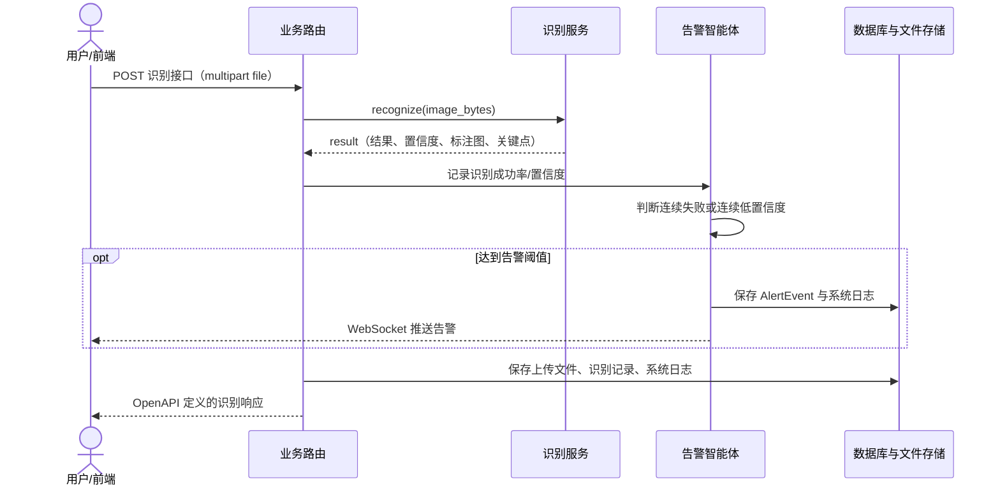
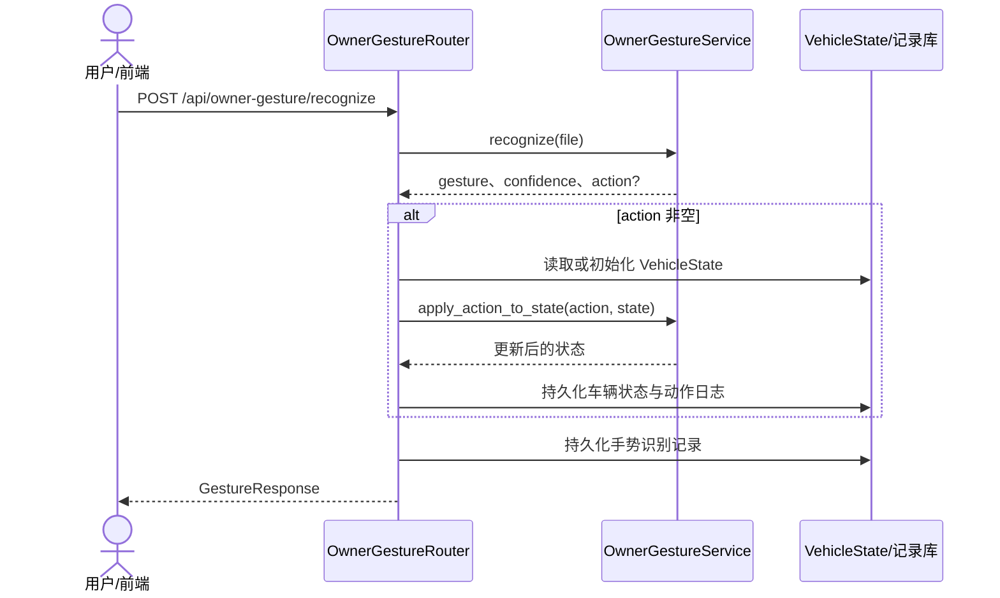

# 项目 API 详细设计

## 1. 规范与入口

- 静态、可评审的 OpenAPI 3.0.3 定义：[openapi.yaml](openapi.yaml)。
- 服务运行时 Swagger UI：`/api/docs`；ReDoc：`/api/redoc`；运行时 JSON：`/api/openapi.json`。
- 认证方式：`Authorization: Bearer <JWT>`。识别接口和车牌历史允许无令牌访问，但有令牌时会关联用户；`/api/auth/me` 必须登录。
- 统一错误约定见：[全局错误码表.md](全局错误码表.md)。
- `annotated_image` 均为 JPEG 的 Base64 字符串；前端展示时使用 `data:image/jpeg;base64,` 前缀。

接口按模块编组：认证 9 个、车牌识别 4 个、交警手势识别 3 个、车主手势控车 5 个、监控与告警 6 个，共 27 个 HTTP 操作（其中车辆状态的 GET 与 PUT 共用一个路径，因此 OpenAPI 共有 26 个 HTTP 路径）。请求、响应、数据模型、认证声明和 HTTP 错误响应均在 OpenAPI 文件中定义，避免本文件重复维护。

## 2. WebSocket 协议（OpenAPI 不覆盖）

### 2.1 告警推送：`GET ws://{host}:8001/ws/alerts`

连接建立后，客户端应保持连接并可发送任意文本作为心跳。产生告警时服务端推送：

```json
{
  "type": "alert",
  "id": 12,
  "level": "warning",
  "event_type": "gesture_low_confidence",
  "title": "手势识别置信度偏低",
  "summary": "...",
  "root_cause": "...",
  "suggestion": "...",
  "created_at": "2026-07-10T10:00:00"
}
```

### 2.2 实时识别：`GET ws://{host}:8001/ws/stream/{module}`

`module` 只能是 `lpr`、`police`、`owner`。客户端发送 Base64 编码的图像帧：

```json
{"type":"frame","data":"/9j/4AAQSkZJRg..."}
```

服务端返回：

```json
{"type":"result","module":"police","data":{"gesture":"stop","confidence":0.83,"...":"..."}}
```

心跳报文为 `{"type":"ping"}`，响应 `{"type":"pong"}`。不支持的模块会返回 `{"error":"无效模块"}` 后关闭连接；运行期间异常使用全局错误码表规定的 `type=error` 报文。

## 3. 关键时序

### 3.1 图像识别与告警



### 3.2 车主手势控车特有流程



## 4. 业务边界

- 车牌识别模块仅负责识别、视频抽帧和 CCPD 样本信息；车牌明细在存储前加密。
- 交警手势模块输出交通指挥手势和姿态关键点，不修改车辆状态。
- 车主手势模块可根据动作修改当前用户的模拟 `VehicleState`。
- 日志监控与告警智能体跨模块采集结果，但不参与三类视觉模型的推理。
