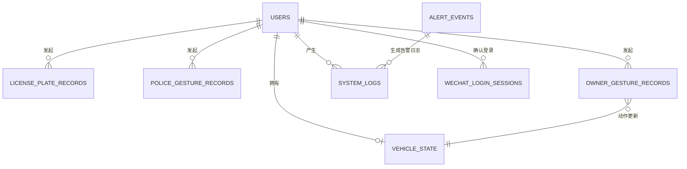

# 数据库表设计

## 1. 概览

系统默认使用 SQLite（`data/app.db`），可通过 `DATABASE_URL` 切换至 SQL Server。表由 SQLAlchemy `Base.metadata.create_all()` 创建；当前模型未声明数据库级外键，用户关联在应用层通过 `user_id` 维护。

| 模块 | 表 | 用途 |
| --- | --- | --- |
| 认证 | `users` | 用户账号与登录状态 |
| 认证 | `verification_codes` | 邮箱/手机验证码 |
| 认证 | `wechat_login_sessions` | 微信扫码登录会话（演示） |
| 车辆车牌识别 | `license_plate_records` | 车牌识别历史 |
| 交警手势识别 | `police_gesture_records` | 交警手势识别历史 |
| 车主手势控车 | `owner_gesture_records` | 车主手势与触发动作历史 |
| 车主手势控车 | `vehicle_state` | 每个用户的模拟车辆状态 |
| 日志监控与告警智能体 | `system_logs` | 系统操作与异常日志 |
| 日志监控与告警智能体 | `alert_events` | 告警事件及处理状态 |

时间字段均使用应用服务器 UTC 时间（`datetime.utcnow()`）。图片原文件存放在 `uploads/`，数据库中保存其路径；标注结果图以 Base64 文本保存。

## 2. 表结构

### 2.1 `users` — 用户

| 字段 | 类型 | 空 | 默认值 | 约束 / 索引 | 说明 |
| --- | --- | --- | --- | --- | --- |
| `id` | INTEGER | 否 | 自增 | 主键、索引 | 用户 ID |
| `username` | VARCHAR(64) | 否 | — | 唯一、索引 | 登录用户名 |
| `email` | VARCHAR(128) | 是 | NULL | 唯一、索引 | 邮箱 |
| `phone` | VARCHAR(20) | 是 | NULL | 唯一、索引 | 手机号 |
| `hashed_password` | VARCHAR(256) | 是 | NULL | — | bcrypt 密码散列；验证码/扫码用户可为空 |
| `is_active` | BOOLEAN | 是 | `true` | — | 是否启用 |
| `created_at` | DATETIME | 是 | 当前 UTC 时间 | — | 创建时间 |

### 2.2 `verification_codes` — 验证码

| 字段 | 类型 | 空 | 默认值 | 约束 / 索引 | 说明 |
| --- | --- | --- | --- | --- | --- |
| `id` | INTEGER | 否 | 自增 | 主键、索引 | 验证码 ID |
| `target` | VARCHAR(128) | 否 | — | 索引 | 邮箱地址或手机号 |
| `code` | VARCHAR(8) | 否 | — | — | 当前为 6 位数字验证码 |
| `purpose` | VARCHAR(32) | 是 | `login` | — | 验证码用途 |
| `expires_at` | DATETIME | 否 | — | — | 失效时间 |
| `used` | BOOLEAN | 是 | `false` | — | 是否已使用 |

### 2.3 `wechat_login_sessions` — 微信扫码会话

| 字段 | 类型 | 空 | 默认值 | 约束 / 索引 | 说明 |
| --- | --- | --- | --- | --- | --- |
| `id` | INTEGER | 否 | 自增 | 主键、索引 | 会话主键 |
| `session_id` | VARCHAR(64) | 是 | NULL | 唯一、索引 | 二维码与轮询使用的会话标识 |
| `status` | VARCHAR(16) | 是 | `pending` | — | `pending` 或 `confirmed` |
| `user_id` | INTEGER | 是 | NULL | 应用层关联 `users.id` | 已确认的登录用户 |
| `created_at` | DATETIME | 是 | 当前 UTC 时间 | — | 创建时间 |

### 2.4 `license_plate_records` — 车牌识别记录

| 字段 | 类型 | 空 | 默认值 | 约束 / 索引 | 说明 |
| --- | --- | --- | --- | --- | --- |
| `id` | INTEGER | 否 | 自增 | 主键、索引 | 记录 ID |
| `user_id` | INTEGER | 是 | NULL | 应用层关联 `users.id` | 发起识别的用户；匿名请求为空 |
| `source_type` | VARCHAR(16) | 是 | `image` | — | 来源类型 |
| `image_path` | VARCHAR(512) | 是 | NULL | — | 上传原图/视频路径 |
| `annotated_image` | TEXT | 是 | NULL | — | 标注图 JPEG 的 Base64 文本 |
| `plates_json` | TEXT | 否 | — | — | 加密后的车牌识别明细 JSON |
| `created_at` | DATETIME | 是 | 当前 UTC 时间 | 索引 | 识别时间 |

`plates_json` 解密后的逻辑结构示例：`{"plates":[{"plate_number":"京A12345","plate_color":"蓝牌","confidence":0.98,"bbox":[10,20,180,70]}]}`。

### 2.5 `police_gesture_records` — 交警手势识别记录

| 字段 | 类型 | 空 | 默认值 | 约束 / 索引 | 说明 |
| --- | --- | --- | --- | --- | --- |
| `id` | INTEGER | 否 | 自增 | 主键、索引 | 记录 ID |
| `user_id` | INTEGER | 是 | NULL | 应用层关联 `users.id` | 发起识别的用户 |
| `source_type` | VARCHAR(16) | 是 | `image` | — | 来源类型 |
| `image_path` | VARCHAR(512) | 是 | NULL | — | 上传文件路径 |
| `gesture` | VARCHAR(32) | 否 | — | — | 英文手势标识，例如 `stop` |
| `gesture_cn` | VARCHAR(32) | 否 | — | — | 中文手势名称 |
| `confidence` | FLOAT | 是 | `0.0` | — | 识别置信度，范围 0–1 |
| `keypoints_json` | TEXT | 是 | NULL | — | MediaPipe 姿态关键点 JSON |
| `annotated_image` | TEXT | 是 | NULL | — | 骨架与结果标注图 Base64 |
| `created_at` | DATETIME | 是 | 当前 UTC 时间 | 索引 | 识别时间 |

### 2.6 `owner_gesture_records` — 车主手势控车记录

| 字段 | 类型 | 空 | 默认值 | 约束 / 索引 | 说明 |
| --- | --- | --- | --- | --- | --- |
| `id` | INTEGER | 否 | 自增 | 主键、索引 | 记录 ID |
| `user_id` | INTEGER | 是 | NULL | 应用层关联 `users.id` | 发起识别的用户 |
| `source_type` | VARCHAR(16) | 是 | `image` | — | 来源类型 |
| `image_path` | VARCHAR(512) | 是 | NULL | — | 上传文件路径 |
| `gesture` | VARCHAR(32) | 否 | — | — | 英文手势标识 |
| `gesture_cn` | VARCHAR(32) | 否 | — | — | 中文手势名称 |
| `confidence` | FLOAT | 是 | `0.0` | — | 识别置信度，范围 0–1 |
| `action` | VARCHAR(64) | 是 | NULL | — | 触发的模拟控车动作；无动作时为空 |
| `keypoints_json` | TEXT | 是 | NULL | — | 手部关键点 JSON |
| `annotated_image` | TEXT | 是 | NULL | — | 标注图 Base64 |
| `created_at` | DATETIME | 是 | 当前 UTC 时间 | 索引 | 识别时间 |

### 2.7 `vehicle_state` — 模拟车辆状态

| 字段 | 类型 | 空 | 默认值 | 约束 / 索引 | 说明 |
| --- | --- | --- | --- | --- | --- |
| `id` | INTEGER | 否 | 自增 | 主键、索引 | 状态 ID |
| `user_id` | INTEGER | 是 | NULL | 应用层关联 `users.id` | 状态所属用户；当前应用逻辑期望每用户一条 |
| `volume` | INTEGER | 是 | `50` | — | 音量 |
| `temperature` | INTEGER | 是 | `24` | — | 空调温度 |
| `phone_status` | VARCHAR(16) | 是 | `idle` | — | 电话状态 |
| `current_page` | VARCHAR(32) | 是 | `home` | — | 车机当前页面 |
| `is_awake` | INTEGER | 是 | `0` | — | 车机唤醒状态，0/1 |
| `updated_at` | DATETIME | 是 | 当前 UTC 时间 | — | 最近更新时间 |

### 2.8 `system_logs` — 系统日志

| 字段 | 类型 | 空 | 默认值 | 约束 / 索引 | 说明 |
| --- | --- | --- | --- | --- | --- |
| `id` | INTEGER | 否 | 自增 | 主键、索引 | 日志 ID |
| `category` | VARCHAR(32) | 是 | NULL | 索引 | 分类：`lpr`、`police_gesture`、`owner_gesture`、`alert`、`user` |
| `level` | VARCHAR(16) | 是 | `INFO` | — | 日志级别 |
| `message` | TEXT | 否 | — | — | 日志正文 |
| `detail_json` | TEXT | 是 | NULL | — | 附加上下文 JSON |
| `user_id` | INTEGER | 是 | NULL | 应用层关联 `users.id` | 相关用户 |
| `created_at` | DATETIME | 是 | 当前 UTC 时间 | 索引 | 记录时间 |

### 2.9 `alert_events` — 告警事件

| 字段 | 类型 | 空 | 默认值 | 约束 / 索引 | 说明 |
| --- | --- | --- | --- | --- | --- |
| `id` | INTEGER | 否 | 自增 | 主键、索引 | 告警 ID |
| `level` | VARCHAR(16) | 是 | NULL | 索引 | `info`、`warning`、`critical` |
| `event_type` | VARCHAR(64) | 是 | NULL | 索引 | 事件类型，例如 `gesture_low_confidence` |
| `title` | VARCHAR(256) | 否 | — | — | 告警标题 |
| `summary` | TEXT | 否 | — | — | 告警摘要 |
| `detail_json` | TEXT | 是 | NULL | — | 告警上下文 JSON |
| `root_cause` | TEXT | 是 | NULL | — | 智能体生成的可能根因 |
| `suggestion` | TEXT | 是 | NULL | — | 智能体生成的处置建议 |
| `channels_sent` | VARCHAR(128) | 是 | `web` | — | 已发送渠道，逗号分隔 |
| `status` | VARCHAR(16) | 是 | `open` | — | `open` 或 `resolved` |
| `created_at` | DATETIME | 是 | 当前 UTC 时间 | 索引 | 告警创建时间 |
| `resolved_at` | DATETIME | 是 | NULL | — | 告警处理时间 |

## 3. 逻辑关系

关系图为业务逻辑关系，不代表当前数据库已创建外键。匿名识别可产生 `user_id = NULL` 的记录。

## 4. 索引与完整性建议

当前已建索引为各表主键，以及 `users.username/email/phone`、`verification_codes.target`、`wechat_login_sessions.session_id`、各记录/日志/告警表的 `created_at`，并在日志与告警表中索引了常用的分类字段。

以下优化不在当前实现范围内，需经确认后配合迁移执行：

1. 为 `vehicle_state.user_id` 增加唯一约束，防止同一用户出现多条当前状态。
2. 为 `verification_codes(target, purpose, used, expires_at)` 增加联合索引，优化验证码校验。
3. 为 `system_logs(category, level, created_at)` 与 `alert_events(status, level, created_at)` 增加联合索引，优化监控筛选。
4. 在明确数据保留策略后，将 Base64 标注图迁移到对象存储，仅保存 URL，控制数据库体积。
5. 若采用 SQL Server 或多服务写入，使用正式迁移工具管理 DDL，并评估为 `user_id` 添加外键及删除策略。
