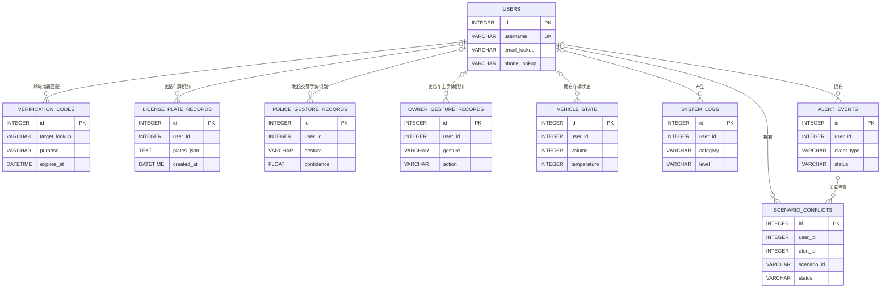

# 数据库表设计

## 1. 概览

当前开发环境通过 `DATABASE_URL` 使用 SQL Server 数据库 `VehicleVisionDB`；未配置该变量时，系统回退到 SQLite（`data/app.db`）。表结构以 SQLAlchemy ORM 模型为准，由 `Base.metadata.create_all()` 创建，并通过启动迁移补充缺失列和用户域索引。

按当前产品功能范围，本设计文档包含 9 张业务表：

| 模块 | 表 | 用途 |
| --- | --- | --- |
| 认证 | `users` | 用户账号、密码和加密联系方式 |
| 认证 | `verification_codes` | 邮箱验证码摘要及使用状态 |
| 车辆车牌识别 | `license_plate_records` | 车牌识别历史 |
| 交警手势识别 | `police_gesture_records` | 交警手势识别历史 |
| 车主手势控车 | `owner_gesture_records` | 车主手势与触发动作历史 |
| 车主手势控车 | `vehicle_state` | 每个用户的模拟车辆状态 |
| 日志监控与告警智能体 | `system_logs` | 系统操作与异常日志 |
| 日志监控与告警智能体 | `alert_events` | 告警分析及处理状态 |
| 跨模块场景融合 | `scenario_conflicts` | 多路感知冲突与告警联动记录 |

当前 ORM 没有声明数据库级外键，`user_id`、`alert_id` 等关联由应用层维护。所有关联字段均可为空，以支持匿名请求。实时库也没有视图、触发器和 `CHECK` 约束。

字段表中的默认值均为 SQLAlchemy 应用层默认值，不是数据库 `DEFAULT` 约束。时间字段由应用服务器以 UTC 时间写入；ORM 的 `BOOLEAN` 在 SQL Server 中映射为 `BIT`，`TEXT` 映射为 `VARCHAR(MAX)`，在 SQLite 中分别映射为 `BOOLEAN` 和 `TEXT`。上传原文件保存在 `uploads/`，数据库保存路径；标注结果图目前以 Base64 文本保存。

## 2. 表结构

### 2.1 `users` — 用户

| 字段 | 类型 | 空 | 默认值 | 约束 / 索引 | 说明 |
| --- | --- | --- | --- | --- | --- |
| `id` | INTEGER | 否 | 自增 | 主键、索引 | 用户 ID |
| `username` | VARCHAR(64) | 否 | — | 唯一、索引 | 登录用户名 |
| `email` | VARCHAR(128) | 是 | NULL | 唯一、索引 | 历史兼容列；安全初始化后保存邮箱盲索引摘要，不保存明文 |
| `phone` | VARCHAR(20) | 是 | NULL | 非空值唯一、过滤索引 | 历史兼容列；保存截断后的手机号盲索引摘要 |
| `email_encrypted` | VARCHAR(512) | 是 | NULL | — | AES 加密后的邮箱原文 |
| `email_lookup` | VARCHAR(64) | 是 | NULL | 索引 | 邮箱盲索引，用于等值查询 |
| `phone_encrypted` | VARCHAR(256) | 是 | NULL | — | AES 加密后的手机号原文 |
| `phone_lookup` | VARCHAR(64) | 是 | NULL | 索引 | 手机号盲索引，用于等值查询 |
| `hashed_password` | VARCHAR(256) | 是 | NULL | — | bcrypt 密码散列；扫码用户可为空 |
| `is_active` | BOOLEAN | 是 | `true` | — | 是否启用 |
| `created_at` | DATETIME | 是 | 当前 UTC 时间 | — | 创建时间 |

### 2.2 `verification_codes` — 验证码

| 字段 | 类型 | 空 | 默认值 | 约束 / 索引 | 说明 |
| --- | --- | --- | --- | --- | --- |
| `id` | INTEGER | 否 | 自增 | 主键、索引 | 验证码 ID |
| `target` | VARCHAR(128) | 否 | — | 索引 | 历史兼容列；当前保存目标邮箱的盲索引摘要 |
| `code` | VARCHAR(8) | 否 | — | — | 历史兼容列；当前固定保存 `hashed` 标记，不保存验证码明文 |
| `target_lookup` | VARCHAR(64) | 是 | NULL | 索引 | 目标邮箱盲索引，与 `users.email_lookup` 摘要匹配 |
| `code_hash` | VARCHAR(64) | 是 | NULL | — | 包含邮箱、用途和验证码的 HMAC 摘要 |
| `purpose` | VARCHAR(32) | 是 | `login` | — | 验证码用途，例如 `login`、`register` |
| `expires_at` | DATETIME | 否 | — | — | 失效时间 |
| `used` | BOOLEAN | 是 | `false` | — | 是否已使用 |

### 2.3 `license_plate_records` — 车牌识别记录

| 字段 | 类型 | 空 | 默认值 | 约束 / 索引 | 说明 |
| --- | --- | --- | --- | --- | --- |
| `id` | INTEGER | 否 | 自增 | 主键、索引 | 记录 ID |
| `user_id` | INTEGER | 是 | NULL | 逻辑关联 `users.id`；复合索引 | 发起识别的用户；匿名请求为空 |
| `source_type` | VARCHAR(16) | 是 | `image` | — | 来源类型，例如图片或视频 |
| `image_path` | VARCHAR(512) | 是 | NULL | — | 上传原图或视频路径 |
| `annotated_image` | TEXT | 是 | NULL | — | 标注图 JPEG 的 Base64 文本 |
| `plates_json` | TEXT | 否 | — | — | AES 加密后的车牌识别明细 JSON |
| `created_at` | DATETIME | 是 | 当前 UTC 时间 | 索引；复合索引 | 识别时间 |

复合索引：`ix_lpr_records_user_created(user_id, created_at)`。

`plates_json` 解密后的逻辑结构示例：`{"plates":[{"plate_number":"京A12345","plate_color":"蓝牌","confidence":0.98,"bbox":[10,20,180,70]}]}`。

### 2.4 `police_gesture_records` — 交警手势识别记录

| 字段 | 类型 | 空 | 默认值 | 约束 / 索引 | 说明 |
| --- | --- | --- | --- | --- | --- |
| `id` | INTEGER | 否 | 自增 | 主键、索引 | 记录 ID |
| `user_id` | INTEGER | 是 | NULL | 逻辑关联 `users.id`；复合索引 | 发起识别的用户；匿名请求为空 |
| `source_type` | VARCHAR(16) | 是 | `image` | — | 来源类型 |
| `image_path` | VARCHAR(512) | 是 | NULL | — | 上传文件路径 |
| `gesture` | VARCHAR(32) | 否 | — | — | 英文手势标识，例如 `stop` |
| `gesture_cn` | VARCHAR(32) | 否 | — | — | 中文手势名称 |
| `confidence` | FLOAT | 是 | `0.0` | — | 识别置信度，业务期望范围 0–1 |
| `keypoints_json` | TEXT | 是 | NULL | — | 姿态关键点 JSON |
| `annotated_image` | TEXT | 是 | NULL | — | 骨架与结果标注图 Base64 |
| `created_at` | DATETIME | 是 | 当前 UTC 时间 | 索引；复合索引 | 识别时间 |

复合索引：`ix_police_records_user_created(user_id, created_at)`。

### 2.5 `owner_gesture_records` — 车主手势控车记录

| 字段 | 类型 | 空 | 默认值 | 约束 / 索引 | 说明 |
| --- | --- | --- | --- | --- | --- |
| `id` | INTEGER | 否 | 自增 | 主键、索引 | 记录 ID |
| `user_id` | INTEGER | 是 | NULL | 逻辑关联 `users.id`；复合索引 | 发起识别的用户；匿名请求为空 |
| `source_type` | VARCHAR(16) | 是 | `image` | — | 来源类型 |
| `image_path` | VARCHAR(512) | 是 | NULL | — | 上传文件路径 |
| `gesture` | VARCHAR(32) | 否 | — | — | 英文手势标识 |
| `gesture_cn` | VARCHAR(32) | 否 | — | — | 中文手势名称 |
| `confidence` | FLOAT | 是 | `0.0` | — | 识别置信度，业务期望范围 0–1 |
| `action` | VARCHAR(64) | 是 | NULL | — | 触发的模拟控车动作；无动作时为空 |
| `keypoints_json` | TEXT | 是 | NULL | — | 手部关键点 JSON |
| `annotated_image` | TEXT | 是 | NULL | — | 标注图 Base64 |
| `created_at` | DATETIME | 是 | 当前 UTC 时间 | 索引；复合索引 | 识别时间 |

复合索引：`ix_owner_records_user_created(user_id, created_at)`。

### 2.6 `vehicle_state` — 模拟车辆状态

| 字段 | 类型 | 空 | 默认值 | 约束 / 索引 | 说明 |
| --- | --- | --- | --- | --- | --- |
| `id` | INTEGER | 否 | 自增 | 主键、索引 | 状态 ID |
| `user_id` | INTEGER | 是 | NULL | 逻辑关联 `users.id`；非唯一索引 | 状态所属用户；应用逻辑期望每用户一条，但数据库尚未强制唯一 |
| `volume` | INTEGER | 是 | `50` | — | 音量 |
| `temperature` | INTEGER | 是 | `24` | — | 空调温度 |
| `phone_status` | VARCHAR(16) | 是 | `idle` | — | 电话状态 |
| `current_page` | VARCHAR(32) | 是 | `standby` | — | 车机当前页面 |
| `is_awake` | INTEGER | 是 | `0` | — | 车机唤醒状态，0/1 |
| `updated_at` | DATETIME | 是 | 当前 UTC 时间 | — | 最近更新时间 |

索引：`ix_vehicle_state_user(user_id)`，当前不是唯一索引。

### 2.7 `system_logs` — 系统日志

| 字段 | 类型 | 空 | 默认值 | 约束 / 索引 | 说明 |
| --- | --- | --- | --- | --- | --- |
| `id` | INTEGER | 否 | 自增 | 主键、索引 | 日志 ID |
| `category` | VARCHAR(32) | 是 | NULL | 索引 | 分类，例如 `lpr`、`police_gesture`、`owner_gesture`、`alert`、`user` |
| `level` | VARCHAR(16) | 是 | `INFO` | — | 日志级别 |
| `message` | TEXT | 否 | — | — | 日志正文 |
| `detail_json` | TEXT | 是 | NULL | — | 附加上下文 JSON |
| `user_id` | INTEGER | 是 | NULL | 逻辑关联 `users.id`；复合索引 | 相关用户；匿名日志为空 |
| `created_at` | DATETIME | 是 | 当前 UTC 时间 | 索引；复合索引 | 记录时间 |

复合索引：`ix_system_logs_user_created(user_id, created_at)`。

### 2.8 `alert_events` — 告警事件

| 字段 | 类型 | 空 | 默认值 | 约束 / 索引 | 说明 |
| --- | --- | --- | --- | --- | --- |
| `id` | INTEGER | 否 | 自增 | 主键、索引 | 告警 ID |
| `user_id` | INTEGER | 是 | NULL | 逻辑关联 `users.id`；索引、复合索引 | 告警所属用户；匿名告警为空 |
| `level` | VARCHAR(16) | 是 | NULL | 索引 | 业务值例如 `info`、`warning`、`critical` |
| `event_type` | VARCHAR(64) | 是 | NULL | 索引 | 事件类型，例如 `gesture_low_confidence` |
| `title` | VARCHAR(256) | 否 | — | — | 告警标题 |
| `summary` | TEXT | 否 | — | — | 告警摘要 |
| `detail_json` | TEXT | 是 | NULL | — | 告警上下文 JSON |
| `root_cause` | TEXT | 是 | NULL | — | 智能体生成的可能根因 |
| `suggestion` | TEXT | 是 | NULL | — | 智能体生成的处置建议 |
| `channels_sent` | VARCHAR(128) | 是 | `web` | — | 已发送渠道，逗号分隔 |
| `status` | VARCHAR(16) | 是 | `open` | 复合索引 | `open` 或 `resolved` |
| `resolution_note` | TEXT | 是 | NULL | — | 人工或自动处置说明 |
| `system_health_json` | TEXT | 是 | NULL | — | 生成告警时的系统健康快照 JSON |
| `created_at` | DATETIME | 是 | 当前 UTC 时间 | 索引、复合索引 | 告警创建时间 |
| `resolved_at` | DATETIME | 是 | NULL | — | 告警处理时间 |

复合索引：`ix_alert_events_user_created(user_id, created_at)`、`ix_alert_events_user_status_created(user_id, status, created_at)`。

### 2.9 `scenario_conflicts` — 场景冲突

| 字段 | 类型 | 空 | 默认值 | 约束 / 索引 | 说明 |
| --- | --- | --- | --- | --- | --- |
| `id` | INTEGER | 否 | 自增 | 主键、索引 | 冲突记录 ID |
| `user_id` | INTEGER | 是 | NULL | 逻辑关联 `users.id`；索引、复合索引 | 冲突所属用户；匿名冲突为空 |
| `scenario_id` | VARCHAR(64) | 否 | — | 索引 | 一次场景融合事件的业务标识 |
| `conflict_type` | VARCHAR(64) | 否 | — | 索引 | 冲突类型 |
| `severity` | VARCHAR(16) | 否 | — | 索引 | 冲突严重级别 |
| `status` | VARCHAR(16) | 是 | `open` | 索引 | `open` 或 `resolved` |
| `sources_json` | TEXT | 是 | NULL | — | 触发冲突时的多路感知快照 JSON |
| `fusion_recommendation` | TEXT | 否 | — | — | 场景融合服务给出的处置建议 |
| `suppress_owner_actions` | VARCHAR(8) | 是 | `0` | — | 是否抑制车主动作，字符串 `0` 或 `1` |
| `alert_id` | INTEGER | 是 | NULL | 逻辑关联 `alert_events.id`；索引 | 关联告警；告警未创建时为空 |
| `resolution_note` | TEXT | 是 | NULL | — | 冲突处置说明 |
| `created_at` | DATETIME | 是 | 当前 UTC 时间 | 索引、复合索引 | 冲突创建时间 |
| `resolved_at` | DATETIME | 是 | NULL | — | 冲突处理时间 |

复合索引：`ix_scenario_conflicts_user_created(user_id, created_at)`。

## 3. 逻辑关系

上图是业务逻辑 ER 图，不代表数据库已创建外键：

- 关系左端为 `o|`，表示一条子记录可以没有用户，也最多逻辑匹配一个用户；右端 `o{` 表示一个用户可以拥有零到多条记录。
- `vehicle_state` 的数据库基数目前仍是零到多；应用逻辑期望每名用户最多一条，但 `user_id` 尚无唯一约束。
- `verification_codes.target_lookup` 通过摘要匹配 `users.email_lookup`，注册验证码可能早于用户创建，因此不是 ID 外键。
- `scenario_conflicts.alert_id` 是可空的逻辑引用；当前创建流程通常一条冲突对应零或一条告警，但数据库没有唯一约束。
- `owner_gesture_records` 更新 `vehicle_state` 是共享 `user_id` 的业务行为，两表没有直接引用列；`alert_events` 与 `system_logs` 通过用户、时间窗口和内容进行相关，也没有直接引用列。

## 4. 当前索引

除主键外，各表当前主要索引如下：

| 表 | 当前索引 |
| --- | --- |
| `users` | `username`、`email` 唯一索引；`phone IS NOT NULL` 过滤唯一索引；`email_lookup`、`phone_lookup` 单列索引 |
| `verification_codes` | `target`、`target_lookup` 单列索引 |
| `license_plate_records` | `created_at`；`(user_id, created_at)` |
| `police_gesture_records` | `created_at`；`(user_id, created_at)` |
| `owner_gesture_records` | `created_at`；`(user_id, created_at)` |
| `vehicle_state` | `user_id` 非唯一索引 |
| `system_logs` | `category`、`created_at`；`(user_id, created_at)` |
| `alert_events` | `user_id`、`level`、`event_type`、`created_at`；`(user_id, created_at)`；`(user_id, status, created_at)` |
| `scenario_conflicts` | `user_id`、`scenario_id`、`conflict_type`、`severity`、`status`、`alert_id`、`created_at`；`(user_id, created_at)` |

ORM 在每个主键上还声明了 `index=True`，因此实际数据库除主键索引外还存在 `ix_*_id` 索引；这类索引通常与主键索引重复。

## 5. 完整性与演进建议

以下优化不在当前实现范围内，执行前需要确认数据保留和删除策略：

1. 为 `vehicle_state.user_id` 设计跨 SQLite / SQL Server 一致的唯一策略，防止并发创建同一用户的多条当前状态。
2. 明确删除策略后，为各表 `user_id` 和 `scenario_conflicts.alert_id` 增加数据库外键；当前所有关系仅由应用层维护。
3. 为置信度、音量、温度、状态和严重级别等字段增加 `NOT NULL`、数据库默认值及 `CHECK` 约束。
4. 引入正式版本化迁移工具；当前启动迁移只能补缺失表、列和部分索引，不能完整管理类型与约束变更。
5. 按验证码查询模式评估 `(target_lookup, purpose, used, expires_at, id)` 联合索引。
6. 将 Base64 标注图迁移到对象存储或文件存储，仅在数据库保存路径和元数据，控制数据库体积。
7. 若需要完整 Unicode、跨时区或多服务写入，评估 SQL Server `NVARCHAR`、带时区时间策略以及数据库端默认值。
8. 清理与主键重复的 `ix_*_id` 索引，减少写入和存储开销。
